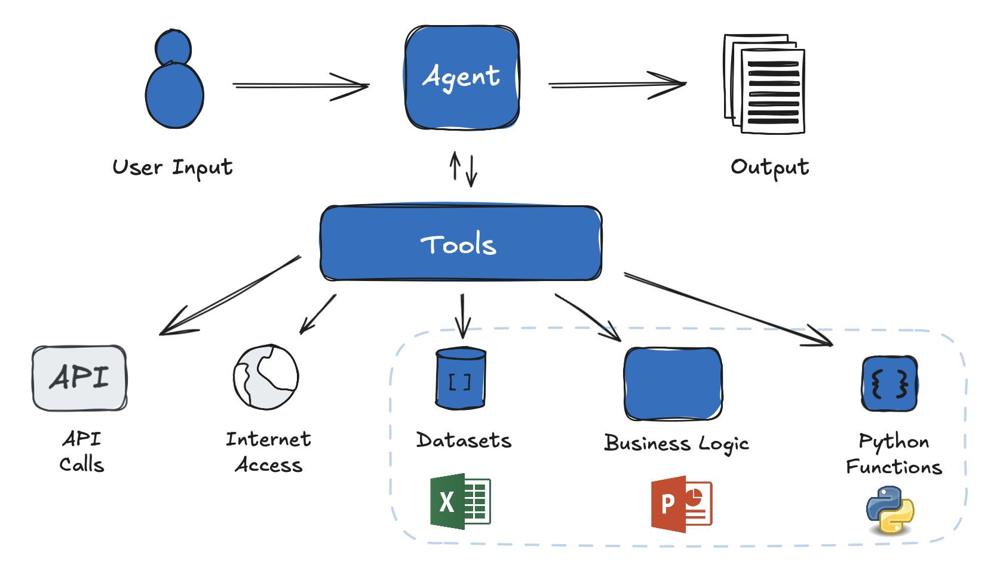
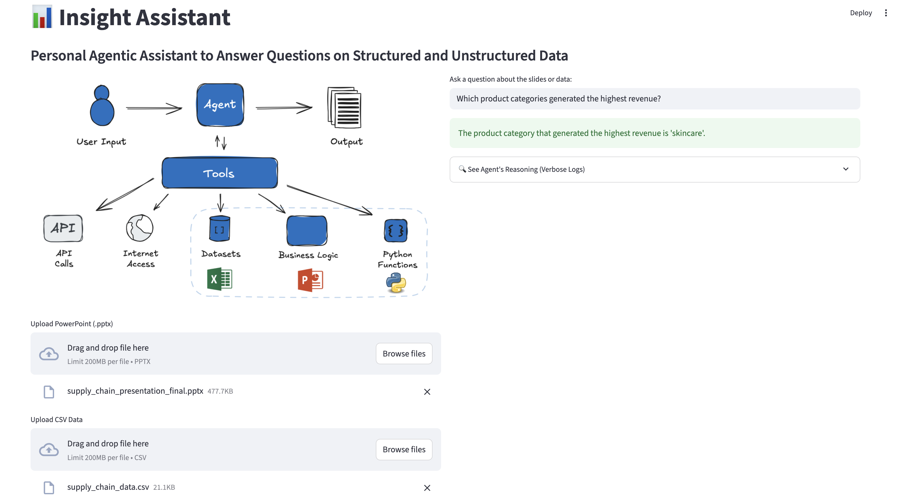

# Insight Assistant

An AI-powered assistant that answers questions from **PowerPoint presentations** and **CSV datasets** using advanced language models and pandas.

Perfect for business users, analysts, and leaders to quickly extract insights from presentations and supporting data.

---

##  Features
- Extracts text from uploaded PowerPoint decks (.pptx).
- Analyzes CSV data using pandas (supports advanced queries).
- Natural language Q&A with AI agents (GPT-4 powered via LangChain).
- Shows full agent reasoning logs (“thoughts”) for transparency.
- Easy-to-use **Streamlit** front-end.
- 


---

##  Example Use Cases
- Summarize insights from slide decks and CSV reports.
- Answer supply chain, sales, or operational questions from reports.
- Quickly identify trends in uploaded data.

---

##  Screenshot



---

##  Installation & Setup

1. **Clone the repository:**
```bash
git clone https://github.com/alkhalifas/insight-assistant
cd insight-assistant
````

2. **Install dependencies:**

```bash
pip install -r requirements.txt
```

3. **Set your OpenAI API key:**
   Create a `.env` file in the root directory:

```bash
OPENAI_API_KEY=your_openai_api_key_here
```

4. **Run the app:**

```bash
streamlit run app.py
```

---

##  Folder Structure

```
ppt-data-assistant/
│
├── app.py               # Streamlit app
├── agent.py             # LangChain agent & tools
├── extractors.py        # File parsers for PPTX & CSV
├── requirements.txt     # Python dependencies
├── data/                # Example data files
│   ├── supply_chain_data.csv
│   └── supply_chain_presentation_final.pptx
├── .env                 # Your OpenAI API key (not included in repo)
├── screenshot.png       # Screenshot of app in use (add your screenshot here)
└── README.md            # This file
```

---

##  Example Question Ideas

* “Show the total revenue per product category.”
* “Which products have the highest defect rates?”
* “What is the average lead time for orders?”
* “Search for ‘cost reduction’ in the slides.”

---

##  Notes

* The agent supports **pandas Python expressions** (via `DataFrameEval` tool).
* PowerPoint search uses basic keyword matching.
* All agent reasoning steps are displayed in the app for full transparency.

---

## License

This project uses the **CC0: Public Domain** dataset from Kaggle:
[https://www.kaggle.com/datasets/harshsingh2209/supply-chain-analysis](https://www.kaggle.com/datasets/harshsingh2209/supply-chain-analysis)


